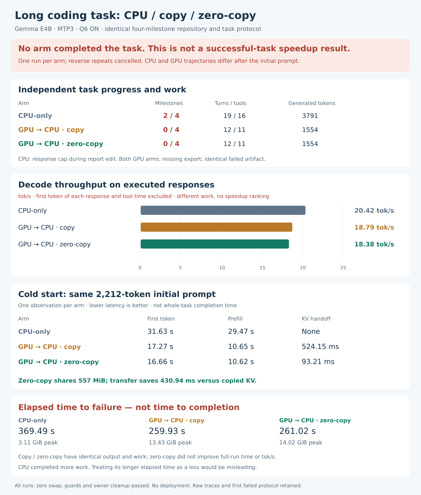

# Long agentic task: CPU-only, copied KV and zero-copy

**None of the three arms completed the task.** CPU-only passed two of four milestones; both GPU-prefill arms failed the first milestone with identical code and output. These runs provide a three-way execution diagnostic, not a successful long-task speedup comparison.



[PNG](charts/long-task-three-arm.png) · [Raw metrics CSV](results.csv) · [Structured results](summary.json) · [Cold-prefix comparison](cold-diagnostic.json)

| Metric | CPU-only | GPU prefill + copied KV | GPU prefill + zero-copy |
|---|---:|---:|---:|
| Milestones passed | **2/4** | 0/4 | 0/4 |
| Turns / tool calls | 19 / 16 | 12 / 11 | 12 / 11 |
| Generated tokens | 3,791 | 1,554 | 1,554 |
| Time to failure | 369.49 s | 259.93 s | 261.02 s |
| Decode throughput on executed responses | 20.42 tok/s | 18.79 tok/s | 18.38 tok/s |
| First token, same initial prompt | 31.63 s | 17.27 s | 16.66 s |
| Initial prefill | 29.47 s | 10.65 s | 10.62 s |
| KV handoff | None | 524.15 ms | 93.21 ms |
| Peak cgroup memory | 3.11 GiB | 13.43 GiB | 14.02 GiB |

One fresh process per arm. The initial prompt is identical at **2,212 tokens**, and all three first responses contain the same 16 tokens. Later CPU and GPU prompts/tool trajectories diverge. Comparing their overall times or generated-token rates as equal-work speedups would be misleading: CPU completed more of the task.

Copy and zero-copy have identical prompts, raw output, final artifact and work: 1,554 generated, 7,410 evaluated, 1,332 drafted and 1,110 accepted tokens. Zero-copy shares the same **584,056,832-byte / 557 MiB** KV payload that the copied arm transfers. It saves **430.94 ms** in the transfer, but whole failed-run time is slightly higher and observed decode throughput is slightly lower. No repeated sample or confidence interval establishes a general throughput effect.

## What failed

- **CPU-only:** normalisation and aggregation passed independent tests. During the report milestone, a write response reached the 2,048-token limit mid-code. The current artifact passed six tests and failed one row-ordering test; it was not manually repaired.
- **Copied and zero-copy:** edits removed the required `normalizeUsageEvents` export. Visible tests failed, the model nevertheless reported completion, and the independent hidden grader rejected the result. Both arms stopped at the same failure.

These are model task failures, not resource or KV-ownership failures. All runtime verifiers passed; that does not turn the task result into success. The planned reverse repetitions were cancelled after the failed baseline rather than used to produce timing statistics for unsuccessful tasks. A successful three-way long-task comparison remains unestablished.

## Task and fixed settings

The agent edits a four-file TypeScript usage-reporting library using real read, search, whole-file write and fixed sandbox test tools. Four cumulative milestones cover UTC normalisation, account/day aggregation, report totals and retry-idempotency conflicts. Each has separate visible and hidden tests. The reference implementation is available only to the offline harness and is never exposed through model tools or mounted in model test containers.

All arms use the same qualified current CPU/common runtime, Gemma E4B Q4 target, Q8 MTP assistant, greedy sampling, MTP depth 3, Q6 option ON, eight decode threads, sixteen prefill threads, F16 KV, FA disabled and batch/microbatch 256. The native caller reports 32K allocated context capacity; observed maximum prompt lengths are **13,243 CPU** and **8,280 GPU**, not 32K populated-context qualification.

The CPU arm never loads the GPU plugin and performs no handoff. Both GPU arms use the same current O3 Vulkan plugin (`41878681…`) and cached/coherent source allocation. The copied arm temporarily disables only CPU-view discovery during transfer; normal and exception restoration pass the control selftest. The same caller (`e3cfc8f2…`) runs all three routes. Full frozen identities are in `freeze.json` and per-run manifests.

Each run is capped at 1,200 seconds, 16 GiB memory, zero swap, at least 6 GiB host reserve, 48 turns, 2,048 tokens per turn and 12,288 total generated tokens. Each fixed tool container is networkless, read-only apart from bounded temporary space, limited to 256 MiB and ten seconds. No model-supplied shell commands execute.

The earlier 1,024-token protocol failed after four reads and a truncated prose/code answer, before any milestone. That original CPU attempt, caller, freeze and tests are retained in the sibling `xe-long-agentic-20260914` directory. V2 changed the per-response cap and instructed tool-only code application equally for all arms; fixtures and total output budget stayed unchanged. No further protocol tuning or retries followed the v2 failures.

## Metrics and verification

Decode throughput is `sum(generated_tokens - 1) / sum(last_emission - first_emission)` over responses with at least two emitted tokens. This weights the actual emission intervals; it does not average per-turn tok/s. It excludes each response's first-token work and tool execution. Effective output tokens per whole-task second are separately retained in `results.csv`.

Whole time is measured from native launch through tools, independent grading and cleanup, until success/failure classification. Hashing and fixture preparation happen before that interval. These are warm-filesystem-cache fresh processes, not cold-disk results.

- The seed fails as expected; all four cumulative visible and four hidden reference suites pass. Nine path/write/symlink guards and eight vocabulary-prefix/four append-mutation checks pass.
- All three runs verify route byte counters, loaded CPU/GPU maps, positioned KV history, warm-prefix reuse, per-token timings, frozen manifests and independent grade counts.
- No sampled competitors, worker/cgroup swap, memory-limit/OOM events or CPU quota throttling. Services remain unchanged. All native GPU/CPU/MTP owners, tool containers and temporary grade directories drained before release.
- `results.test.ts` checks all three failed outcomes, exact copied/shared work and cold transfer arithmetic. The PNG was rendered from the SVG and inspected.

Offline checks from this directory:

```sh
sha256sum -c SHA256SUMS
bun analyze.ts
bun handoff-diagnostic.ts
bun chart.ts
bun test results.test.ts
sha256sum -c SHA256SUMS
```

Native launch scripts contain historical absolute workspace paths and require fresh resource admission; old admission records embedded in manifests are evidence only. Compiled binaries and model weights are not bundled. No deployment, service changes, production kernel edits or changes to the earlier completed benchmark campaigns.
