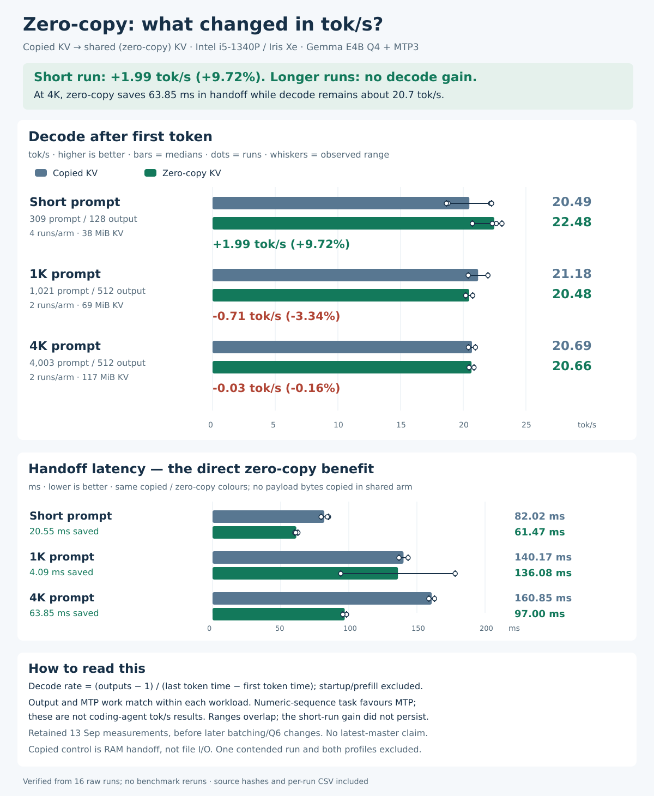

# Zero-copy KV: decode throughput and handoff latency

Zero-copy measured **22.48 tok/s versus 20.49 tok/s** for copied KV on the short workload, a **9.72% higher median**. That decode gain did not persist in the longer runs. At 4K, decode was effectively tied while zero-copy saved **63.85 ms** during handoff.



[PNG chart](zero-copy-throughput.png) · [Summary CSV](throughput-summary.csv) · [All 16 runs](throughput-runs.csv) · [Structured data](data.json)

| Prompt / output tokens | Runs per arm | Copied decode | Zero-copy decode | Decode difference | Handoff saved |
|---|---:|---:|---:|---:|---:|
| 309 / 128 | 4 | 20.49 tok/s | 22.48 tok/s | +1.99 tok/s (+9.72%) | 20.55 ms |
| 1,021 / 512 | 2 | 21.18 tok/s | 20.48 tok/s | -0.71 tok/s (-3.34%) | 4.09 ms |
| 4,003 / 512 | 2 | 20.69 tok/s | 20.66 tok/s | -0.03 tok/s (-0.16%) | 63.85 ms |

Bars are medians, dots are individual observations and whiskers are observed min/max ranges. They are not confidence intervals. Decode ranges overlap for every workload; four or two observations per arm do not establish a precise general throughput gain.

## What was measured

These retained measurements were collected on 13 September 2026 using Intel i5-1340P / Iris Xe, Gemma E4B QAT Q4_0 and a CPU Q8_0 MTP assistant, depth 3. Both arms perform the same GPU prefill with shared-capable cached/coherent source allocations. The copied control bypasses CPU-view acquisition only during the synchronous transfer and uses bounded RAM copying. The zero-copy arm shares the KV payload and copies zero payload bytes. This is not the historical file-I/O handoff comparison.

Decode tok/s is `(emitted tokens - 1) / (last emission time - first emission time)`. It includes target, assistant, sampling, rejection handling and output work between emissions. Startup, GPU prefill and first-token latency are excluded. The full-process rates are retained separately in `data.json` and the per-run CSV.

The fixed numeric-sequence prompts favour MTP: all short runs draft 96 tokens and accept 94; all longer runs draft 384 and accept 382. Output and prompt hashes, evaluated-token counts and MTP work match within each workload. Outputs stop at the token budget; these are not coding-agent tok/s or broad task-quality measurements.

The short group uses counterbalanced share/copy/copy/share/copy/share/share/copy order. The 1K group uses share/copy/copy/share; 4K uses copy/share/share/copy. The allocation payloads are 38, 69 and 117 MiB respectively, not just bytes corresponding to populated cells. Model file cache was warm.

These results precede later allocation batching and Q6 changes. No latest-master throughput claim or summed optimisation percentages. The [agentic campaign](../xe-hotspots-agentic-20260913/README.md) and [fresh-master qualification](../xe-master-agentic-20260914/README.md) measure separate workloads and runtime identities.

## Transfer savings versus decoding

| Prompt / output tokens | Copied handoff | Zero-copy handoff | Saved |
|---|---:|---:|---:|
| 309 / 128 | 82.02 ms | 61.47 ms | 20.55 ms |
| 1,021 / 512 | 140.17 ms | 136.08 ms | 4.09 ms |
| 4,003 / 512 | 160.85 ms | 97.00 ms | 63.85 ms |

At 1K, one slow shared-handoff observation makes the two-run median noisy. At 4K the transfer saving is clear in the retained observations, while decode remains about 20.7 tok/s. Eliminating the payload copy does not eliminate model loading, prefill, metadata preparation or inference.

## Reproduce the chart without inference

This directory includes 66 byte-identical input files: per-run metrics, summaries, manifests and guarded results for 16 valid unprofiled runs, plus the two original aggregate summaries. Original workspace-relative paths are preserved below `inputs/`; absolute historical paths inside manifests are provenance, not required live assets.

From this directory, with Bun installed:

```sh
sha256sum -c SHA256SUMS
(cd inputs && sha256sum -c ../source-checksums.sha256)
bun generate.ts
bun test generate.test.ts
sha256sum -c SHA256SUMS
```

The portable generator reproduces the delivered SVG, JSON and CSV exactly from bundled inputs; its timestamp is fixed to the delivered chart. The PNG is the retained rendering of that SVG. No model files, compiled runtimes, GPU access or inference tools are required.

The generator recomputes throughput from raw first/last emission times and handoff latency from event boundaries. It checks sharing/copy counters, workload equality, resource samples, unchanged services and the original medians. Explicit run lists exclude the incomplete contended r4 attempt and both diagnostic profiles; the valid r4 retry is included. Earlier failed-attempt details remain in the source campaigns, not in the chart sample set.

Three tests / 53 assertions cover sample membership, medians, ranges, deltas and visible gain/regression/neutral outcomes. See [the original short-run report](../xe-in-memory-20260913/README.md) and [the handoff API](../../../docs/in-memory-kv-handoff.md). No benchmark reruns, deployment or service changes were made for this publication.
